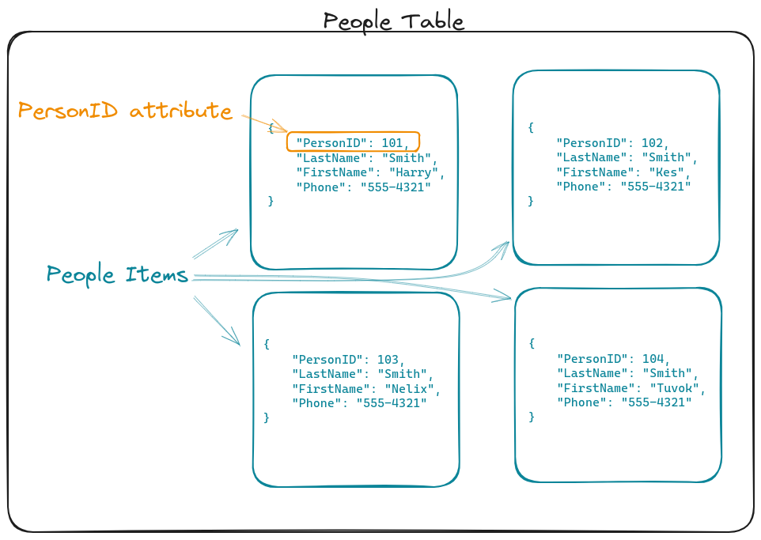
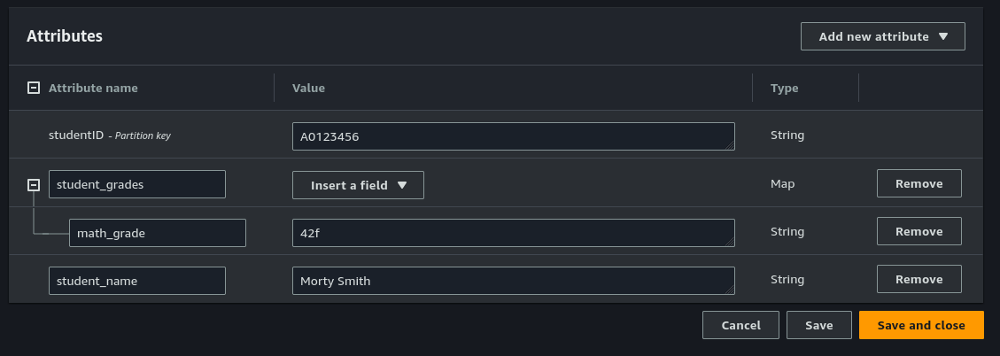

# Learning outcomes and topics

- Create a dynamic Ansible inventory
- Design a simple DynamoDB database
- Provision a DyanmoDB table with Terraform
## Upcoming

- Quiz two will be week 13
# Dynamic Ansible inventories

So far we have been creating static inventories. The inventory of servers that we manage is a simple hard coded list. This is great if we know we are going to be working with the same servers for an extended period of time. It is simple, for a small number of servers you can open up a plain text file to learn IP addresses and see how your servers are grouped.

For a more ephemeral workload, servers that we create and destroy regularly, it is a little inconvenient. Fortunately you can create a dynamic inventory that uses a plugin or script to create a dynamic list of your servers.

We are going to use the `amazon.aws.aws_ec2` plugin. This plugin uses the AWS config and credentials in the `~/.aws` directory that we setup when we installed the AWS CLI.

## Creating a dynamic inventory

Start by editing your `ansible.cfg` file in your Ansible projects root. You will need to change the `private_key_file` to match the private key that corresponds to your public key on your ec2 instances.

```
[defaults]
inventory = inventory
remote_user = ubuntu
private_key_file = ~/.ssh/bcit-key

[inventory]
enabled_plugins = amazon.aws.aws_ec2 yaml

[ssh_connection]
host_key_checking=False
ssh_common_args= -o StrictHostKeyChecking=no -o UserKnownHostsFile=/dev/null
ansible_ssh_common_args= -o StrictHostKeyChecking=no -o UserKnownHostsFile=/dev/null
```

The `ansible.cfg` file sets the location for the inventory (inside an inventory directory). It also enables two plugins needed for the inventory file: yaml(because the inventory is a yaml file) and amazon.aws.aws_ec2(which uses our aws credentials to access ec2 instances). Plugins here are optional, these will be loaded by "auto" as needed, most of the time.

Next create a new `inventory` directory in the Ansible project root. Inside of the `inventory` directory create a new file`hosts.aws_ec2.yaml` file. This is where we actually use the plugin to create a dynamic inventory.

```yaml
---
plugin: amazon.aws.aws_ec2
regions:
- us-west-2

# Set individual Variables
compose:
ansible_host: public_ip_address

# Create groups
keyed_groups:

# add hosts to group for each Name
  - key: tags.Name
    prefix: ""
    separator: ""

```

**Reference:**

[Ansible Docs Working with dynamic inventories](https://docs.ansible.com/ansible/latest/inventory_guide/intro_dynamic_inventory.html)

## In class exercise 1

Using your terraform configuration from assignment two provision infrastructure that includes at least two ec2 instances. After provisioning your infrastructure use the provided `ansible.cfg` and `hosts.aws_ec2.yaml`above to create a dynamic inventory. 

To test that everything is working run the command `ansible-inventory --graph` if you get back a list that contains your ec2 instances your dynamic inventory setup is working. 
# DynamoDB

Amazon describes DynamoDB as a "Servrless, NoSQL, fully managed database" They go on to describe some of the benefits including speed and scalability. Like most "NoSQL" databases I think one of the big benefits is flexibility. If you don't know exactly what your data is going to look like a database like DynamoDB might be a good fit. 

Generally DynamoDB is combined with other "serverless" tools, like AWS Lambda. Serverless is a pretty big topic, today we are just going to look at DynamoDB.


## tables

data is stored in a table. A table is really just a collection of items, and should not be compared to tables in a SQL database

## Items

An Item is a collection of attributes. The "People Table" above contains four items which represent four people.

## Attributes

Items are made of one or more attributes. An attribute is a key value pair. For example in the items above. `PersonID` is an attribute

## primary key

The primary key is required. The primary key uniquely identifies each item in a table.

DynamoDB uses the partition key's value as input to an internal hash function. The output from the hash function determines the partition (physical storage internal to DynamoDB) in which the item will be stored.

In a table that has only a partition key, no two items can have the same partition key value.

The primary key in an AWS dynamodb table is made up of two keys
1. The **partition** key (required)
2. The **sort** key (optional)

Reference:

# Designing a DynamoDB database

## Single table design

> Single table design is a pattern that allows you to store multiple types (entities) of data in a single DynamoDB table. It aims to optimize data access patterns, improve performance, and reduce costs by eliminating the need for maintaining multiple tables and complex relationships between them. 
> [AWS Data Modeling foundations in DynamoDB](https://docs.aws.amazon.com/amazondynamodb/latest/developerguide/data-modeling-foundations.html)

## Multi table design

> Multiple table design is a pattern that is more like a traditional database design where you store a single type(entity) of data in a each DynamoDB table. Data within each table will still be organized by partition key so performance within a single entity type will be optimized for scalability and performance, but queries across multiple tables must be done independently.
> [AWS Data Modeling foundations in DynamoDB](https://docs.aws.amazon.com/amazondynamodb/latest/developerguide/data-modeling-foundations.html)

## Creating a DynamoDB table with Terraform

In Terraform we can create a new table and add items to that table.

[Resource: aws_dynamodb_table](https://registry.terraform.io/providers/hashicorp/aws/latest/docs/resources/dynamodb_table)

[Resource: aws_dynamodb_table_item](https://registry.terraform.io/providers/hashicorp/aws/latest/docs/resources/dynamodb_table_item)

**Reference:**

[DynamoDB data types AWS Docs](https://docs.aws.amazon.com/amazondynamodb/latest/developerguide/HowItWorks.NamingRulesDataTypes.html)

## In class exercise 2

Write terraform configuration that creates a new DynamoDB table named "student_info_table". Use the attribute "studentID" which is of type String as the primary(partition) key.

After creating a table add an item to the table, using Terraform, that matches the item below displayed in the AWS console. The order of attributes in the item doesn't matter.



Finally describe the difference between the billing_mode options. Include sources of any resources you used for this.

### In class exercise submission

You can do these in groups. Just make sure group members names are listed somewhere easy to find in the submission.

submit a "your_name_wk11.zip" that includes the following:
```
ansible/
	ansible.cfg
	inventory/
		hosts.aws_ec2.yaml
main.tf
billing.txt
```


# Flipped learning material

Watch:
- Lesson 8.2 Understanding Roles
- Lesson 8.6 Creating your own Roles

From: [Ansible: From Basic to Guru](https://learning.oreilly.com/course/ansible-from-basics/9780137894949/)